# DeFi Liquidation Alerter - Comprehensive Guide

> A detailed explanation of your liquidation-alerter project: how it works, how to use it, what the metrics mean, and how to improve it.

---

## Table of Contents

1. [Overall Architecture and How Everything Works](#1-overall-architecture-and-how-everything-works)
2. [Current Usability - Is It Ready for Non-Technical Users?](#2-current-usability---is-it-ready-for-non-technical-users)
3. [Key Metrics Explained in Simple Terms](#3-key-metrics-explained-in-simple-terms)
4. [Making It Understandable for Non-Technical Users](#4-making-it-understandable-for-non-technical-users)
5. [Value for Aave and Compound Users](#5-value-for-aave-and-compound-users)
6. [Improvements, Optimizations, and Changes Needed](#6-improvements-optimizations-and-changes-needed)

---

## 1. Overall Architecture and How Everything Works

### High-Level Architecture Diagram

```mermaid
graph TD
    subgraph "User Interface"
        TG["📱 Telegram Bot"]
        API["🌐 Metrics/Health API"]
    end

    subgraph "Core Engine"
        ME["⚙️ MonitoringEngine"]
        AL["🚨 GasAwareAlerter"]
        HC["💉 Health Calculator"]
        AN["📊 Analytics Engine"]
    end

    subgraph "Protocol Adapters"
        AAVE["🔵 Aave V3 Adapter"]
        COMP["🟢 Compound V3 Adapter"]
    end

    subgraph "Data Services"
        PS["💰 Price Service"]
        CL["⛓️ Chainlink Oracle"]
        UNI["🦄 Uniswap TWAP"]
        CG["🦎 CoinGecko API"]
    end

    subgraph "Blockchain Networks"
        ETH["Ethereum"]
        ARB["Arbitrum"]
        BASE["Base"]
        OP["Optimism"]
    end

    subgraph "Storage"
        DB["🗄️ SQLite Database"]
    end

    TG --> ME
    ME --> AL
    ME --> HC
    ME --> AN
    ME --> AAVE
    ME --> COMP
    AAVE --> ETH
    AAVE --> ARB
    AAVE --> BASE
    AAVE --> OP
    COMP --> ETH
    COMP --> ARB
    COMP --> BASE
    COMP --> OP
    PS --> CL
    PS --> UNI
    PS --> CG
    ME --> PS
    ME --> DB
    API --> ME
```



### Step-by-Step: How the System Functions

#### 1. **Blockchain Connection**

The system connects to 4 EVM chains via RPC endpoints:

| Chain | Configuration Key | Purpose |
|-------|-------------------|---------|
| Ethereum | `ETHEREUM_RPC_URL` | Primary network (required) |
| Arbitrum | `ARBITRUM_RPC_URL` | L2 scaling solution |
| Base | `BASE_RPC_URL` | Coinbase L2 |
| Optimism | `OPTIMISM_RPC_URL` | Optimistic rollup |

Each chain gets its own `AsyncWeb3` instance configured in [config.py](file:///Users/user/Desktop/PythonProjects/liquidation-alerter/app/config.py):

```python
def get_rpc_url(self, chain: str) -> str:
    """Get RPC URL for a specific chain with fallback to ethereum_rpc_url."""
    chain = chain.lower()
    chain_url = getattr(self, f"{chain}_rpc_url", None)
    return chain_url or self.ethereum_rpc_url
```

#### 2. **Data Fetching**

The system fetches three types of data:

**A. User Position Data** (from smart contracts):
- Via `web3.py`, calling `getUserAccountData()` on Aave V3 Pool contracts
- Returns: `totalCollateralBase`, `totalDebtBase`, `availableBorrowsBase`, `liquidationThreshold`, `ltv`, `healthFactor`

```python
# From aave_v3.py - actual on-chain call
data = await self._pool_contract.functions.getUserAccountData(
    checksum_address
).call()

total_collateral_base = data[0] / 1e8  # Aave uses 8 decimals
total_debt_base = data[1] / 1e8
health_factor = data[5] / 1e18 if data[5] < 2**255 else float("inf")
```

**B. Price Data** (multi-source with fallback):
1. **Chainlink** (primary) - On-chain oracle, 95% confidence
2. **Uniswap V3 TWAP** (fallback) - DEX-based time-weighted average price
3. **CoinGecko API** (last resort) - Off-chain aggregator, 75% confidence

**C. Gas Prices** (for economical alerting):
- Fetched from current network conditions
- Used to determine if position is worth acting on given transaction costs

#### 3. **Health Factor Calculation**

The core formula is:

```
Health Factor = (Total Collateral in USD × Liquidation Threshold) / Total Debt in USD
```

**Example Walkthrough:**
- You deposit $10,000 of ETH (Liquidation Threshold = 80%)
- You borrow $4,000 USDC
- Health Factor = ($10,000 × 0.80) / $4,000 = **2.0** ✅ Healthy

If ETH drops 50%:
- Collateral now worth $5,000
- Health Factor = ($5,000 × 0.80) / $4,000 = **1.0** 💀 Liquidatable!

#### 4. **The Monitoring Loop**

The [MonitoringEngine](file:///Users/user/Desktop/PythonProjects/liquidation-alerter/app/core/engine.py) runs a **polling-based** continuous loop:


**Key design choice:** Uses **polling** (every 60 seconds by default) rather than event listening. This is simpler and works across all chains but means there's a 1-minute delay in worst case.

#### 5. **Database and Caching**

**Storage**: SQLite with async SQLAlchemy (`aiosqlite`)

Three tables:


**Caching:**
- Price cache with 30-second TTL in [price.py](file:///Users/user/Desktop/PythonProjects/liquidation-alerter/app/services/price.py)
- Alert cooldowns to prevent spam (5 min for liquidatable, 15 min for critical, 1 hr for warning)

#### 6. **Alert System**

The [GasAwareAlerter](file:///Users/user/Desktop/PythonProjects/liquidation-alerter/app/core/alerter.py) is sophisticated:

**Tiered Alert Levels:**
| Status | Health Factor | Emoji | Cooldown |
|--------|---------------|-------|----------|
| Healthy | > 1.5 | 🟢 | 24 hours |
| Warning | 1.1 - 1.5 | 🟡 | 1 hour |
| Critical | 1.0 - 1.1 | 🔴 | 15 minutes |
| Liquidatable | ≤ 1.0 | 💀 | 5 minutes |

**Smart Features:**
1. **Gas Awareness**: If gas costs exceed 5% of position value, includes a warning
2. **Rapid Deterioration Detection**: Alerts if HF drops >10% within 1 hour
3. **Cooldown Management**: Prevents alert fatigue while ensuring critical issues surface

Example alert message:
```
🚨 CRITICAL ALERT 🚨

🔴 Aave V3 (Ethereum) | 0x1234...abcd

Health Factor: 1.08
Collateral: $5.2K
Debt: $4.0K

Critical: Health factor at 1.08. High liquidation risk!

Take Action:
• Repay $800 debt to reach 1.5 HF
• Or deposit $1,500 collateral

Est. Gas Cost: $12.50

⚡ Open Aave V3 (link)
```

---

## 2. Current Usability - Is It Ready for Non-Technical Users?

### Current State Assessment

| Aspect | Status | Details |
|--------|--------|---------|
| Interface | **Telegram Bot** ✅ | User-friendly chat commands |
| Installation | **Developer-level** ⚠️ | Requires Python, uv, environment setup |
| Configuration | **Moderate** ⚠️ | Edit [.env](file:///Users/user/Desktop/PythonProjects/liquidation-alerter/.env) file with RPC URLs |
| Running | **Manual** ⚠️ | Start script or Docker, runs until stopped |
| Monitoring | **Active** ⚠️ | Must keep process running 24/7 |

### Realistic Verdict

> **It's a well-designed prototype/beta tool** - not yet a "plug and play" service, but very usable for technically-inclined users or with modest guidance.

**For everyday users:** The Telegram interface itself is excellent and intuitive. The friction is in **initial setup** (getting RPC URLs, running the Python application).

### Step-by-Step Installation Guide for Beginners

#### Prerequisites

1. **Python 3.11+** - [Download here](https://www.python.org/downloads/)
2. **A Telegram account** - Install Telegram app
3. **RPC endpoints** - Free options:
   - [Alchemy](https://www.alchemy.com/) (recommended, 300M requests/month free)
   - [Infura](https://infura.io/)
   - [QuickNode](https://www.quicknode.com/)

#### Step 1: Get Your Telegram Bot Token

1. Open Telegram and search for **@BotFather**
2. Send `/newbot` and follow the prompts
3. Copy the **API token** (looks like `123456789:ABCdefGHIjklMNOpqrSTUvwxYZ`)

#### Step 2: Get RPC URLs

1. Sign up at [Alchemy](https://dashboard.alchemy.com/)
2. Create apps for each chain you want to monitor:
   - Ethereum Mainnet
   - Arbitrum One
   - Base
   - Optimism
3. Copy each "HTTPS" URL

#### Step 3: Clone and Setup

```bash
# Clone the repository
git clone https://github.com/Alpha-M2/liquidation-alerter.git
cd liquidation-alerter

# Install uv (Python package manager)
curl -LsSf https://astral.sh/uv/install.sh | sh

# Create virtual environment and install dependencies
uv venv
source .venv/bin/activate  # On Windows: .venv\Scripts\activate
uv sync
```

#### Step 4: Configure Environment

```bash
# Copy the example config
cp .env.example .env
```

Edit [.env](file:///Users/user/Desktop/PythonProjects/liquidation-alerter/.env) with your editor (VS Code, nano, etc.):

```env
# Required
TELEGRAM_BOT_TOKEN=your-bot-token-from-botfather

# Required - Ethereum RPC
ETHEREUM_RPC_URL=https://eth-mainnet.g.alchemy.com/v2/your-api-key

# Optional - L2 chains (skip if you only use Ethereum)
ARBITRUM_RPC_URL=https://arb-mainnet.g.alchemy.com/v2/your-api-key
BASE_RPC_URL=https://base-mainnet.g.alchemy.com/v2/your-api-key
OPTIMISM_RPC_URL=https://opt-mainnet.g.alchemy.com/v2/your-api-key

# Optional customizations
MONITORING_INTERVAL_SECONDS=60
HEALTH_FACTOR_THRESHOLD=1.5
CRITICAL_HEALTH_FACTOR_THRESHOLD=1.1
```

#### Step 5: Run the Application

```bash
python -m app.main
```

You should see:
```
Starting DeFi Liquidation Alerter...
Database initialized
Metrics server running on http://0.0.0.0:8080/metrics
Bot started. Press Ctrl+C to stop.
Monitoring engine started
```

#### Step 6: Use the Telegram Bot

1. Open Telegram and message your bot
2. Send `/start` to initialize
3. Add your wallet: `/add 0xYourWalletAddress`
4. Check status: `/status`

### Running 24/7 (Advanced)

For continuous monitoring, you need to keep the process running:

**Option A: Docker (recommended)**
```bash
docker build -t liquidation-alerter .
docker run -d --name liquidation-alerter \
  -e TELEGRAM_BOT_TOKEN=your_token \
  -e ETHEREUM_RPC_URL=your_url \
  liquidation-alerter
```

**Option B: Cloud VPS**
- Deploy to DigitalOcean, AWS, or similar
- Use `systemd` or `supervisor` to keep running

**Option C: Screen/Tmux (simple)**
```bash
screen -S alerter
python -m app.main
# Ctrl+A, then D to detach
```

---

## 3. Key Metrics Explained in Simple Terms

### The Health Factor - Your DeFi "Blood Pressure"

> **Analogy:** Think of Health Factor like your blood pressure reading. Normal blood pressure (120/80) means you're healthy. High blood pressure (160/100) is a warning sign. If it gets extreme, you're at risk of serious problems.

| Health Factor | What It Means | Blood Pressure Analogy |
|---------------|---------------|------------------------|
| ∞ (infinity) | No debt, perfectly safe | N/A - you're not even in the hospital |
| > 2.0 | Very healthy | 120/80 - textbook normal |
| 1.5 - 2.0 | Healthy, some buffer | 130/85 - fine, maybe watch it |
| 1.1 - 1.5 | Warning zone | 140/90 - elevated, take action |
| 1.0 - 1.1 | Critical! | 160/100 - see a doctor NOW |
| ≤ 1.0 | Liquidatable | Medical emergency 🚨 |

**The Formula (simplified):**

```
Health Factor = How much collateral you have (adjusted for risk) / How much you borrowed
```

**Plain English:** It's the ratio of "what you're promising as backup" to "what you owe." If this drops to 1.0 or below, the protocol says "You don't have enough backup for your loan, we're closing your position."

### Total Collateral - What You Deposited

> **Analogy:** This is like the house you put up to secure a mortgage. It's your "skin in the game."

- Displayed in USD value
- Includes all assets you've supplied (ETH, WBTC, stETH, etc.)
- **This value fluctuates** with market prices!

Example: You deposited 3 ETH when ETH was $3,000 → Collateral = $9,000
If ETH drops to $2,000 → Collateral = $6,000 (you still have 3 ETH, but it's worth less)

### Total Debt - What You Borrowed

> **Analogy:** This is your mortgage balance - what you still owe.

- Displayed in USD value
- Usually stablecoins (USDC, USDT, DAI) or volatile assets (ETH, WBTC)
- If you borrow stablecoins, this stays roughly constant
- If you borrow volatile assets, this can change too

### Liquidation Threshold - The Safety Margin

> **Analogy:** When you get a mortgage, the bank doesn't let you borrow 100% of your home's value. Maybe 80%. That 80% is like the liquidation threshold.

- Different assets have different thresholds
- ETH on Aave: ~80-83%
- WBTC: ~75-80%
- Lower threshold = protocol considers it riskier

**What it means:** If threshold is 80%, your collateral value can drop to 80% of your debt before liquidation.

### The Overall Risk Score (0-100)

This is a **custom metric** your tool calculates to make health factors easier to understand:

```python
def calculate_normalized_score(health_factor: float) -> float:
    if health_factor == float("inf") or health_factor > 10:
        return 100.0  # Perfect score
    if health_factor <= 1.0:
        return 0.0    # Critical!
    if health_factor <= 2.0:
        return (health_factor - 1.0) * 80.0  # HF 1.0→2.0 maps to 0→80
    return 80.0 + ((health_factor - 2.0) / 8.0) * 20.0  # HF 2.0→10.0 maps to 80→100
```

| Risk Score | Interpretation |
|------------|----------------|
| 100 | Perfect - no debt or massive buffer |
| 80-100 | Very safe |
| 50-80 | Healthy, monitor occasionally |
| 20-50 | Warning zone, check frequently |
| 0-20 | Critical, action needed now |

### Weighted Health Factor

When you have positions on multiple protocols/chains, the tool calculates a **weighted average**:

```
Weighted HF = Sum(HF × Debt amount per position) / Total Debt
```

This gives more weight to larger positions. A $100k position at HF 1.2 matters more than a $1k position at HF 1.5.

### "Status: Healthy" - What It Really Means

A position is **Healthy** when:
- Health Factor > 1.5 (default threshold, customizable)
- No immediate action required
- You have buffer room for price drops

But "Healthy" doesn't mean "safe forever" - prices can move fast!

### Why ∞ (Infinity) is the Safest

When you see `Health Factor: ∞`, it means:
- You have collateral deposited
- You have **zero debt**
- You literally cannot be liquidated

It's like having a house fully paid off - no one can foreclose on you!

---

## 4. Making It Understandable for Non-Technical Users

### Current Output Example

```
🟢 Portfolio Health Overview

Overall Risk Score: 72/100
Total Collateral: $12.5K
Total Debt: $5.2K
Weighted HF: 1.85

Protocol Breakdown:
🟢 Aave V3 (Ethereum): HF = 2.10
🟡 Aave V3 (Arbitrum): HF = 1.45
```

### Suggested Improvements

#### 1. Traffic Light System ✅ Already Implemented!

Your tool already uses this:
- 🟢 Green = Healthy (HF > 1.5)
- 🟡 Yellow = Warning (HF 1.1-1.5)  
- 🔴 Red = Critical (HF 1.0-1.1)
- 💀 Skull = Liquidatable (HF ≤ 1.0)

#### 2. Plain-English Summary Messages

**Current:**
```
Health Factor: 1.35
Status: Warning
```

**Improved version (suggested enhancement):**
```
⚠️ YOUR POSITION NEEDS ATTENTION

Your position is at risk. If prices drop another 15%, 
you could get liquidated and lose ~$500-1,000.

What you can do RIGHT NOW:
1. Add $2,000 more collateral to be safe
2. Or repay $1,500 of your loan
3. Or swap some collateral for a safer asset

[🛡️ Add Collateral] [💰 Repay Debt]
```

#### 3. Percentage-Based Risk Display

Instead of raw Health Factor numbers:

```
╔══════════════════════════════════════╗
║  LIQUIDATION RISK METER              ║
╠══════════════════════════════════════╣
║  ████████████░░░░░░  65% SAFE        ║
║                                      ║
║  You can survive a 25% price crash   ║
╚══════════════════════════════════════╝
```

#### 4. Non-Technical Interface Ideas

**A. Telegram Bot Enhancements (already your interface):**
- Add inline keyboard buttons for quick actions
- Daily summary at a set time: "Good morning! All 3 positions healthy ✅"
- Trend indicators: "HF improved 📈 from 1.4 to 1.7 today"

**B. Web Dashboard (Streamlit/Flask):**
```
┌─────────────────────────────────────────────┐
│  [Your Profile Picture]  Welcome, 0x12..cd  │
├─────────────────────────────────────────────┤
│                                             │
│  OVERALL HEALTH                             │
│  ████████████████░░░░  80% SAFE             │
│                                             │
│  ┌─────────────┐ ┌─────────────┐           │
│  │ COLLATERAL  │ │    DEBT     │           │
│  │   $12,500   │ │   $5,200    │           │
│  │ ETH, WBTC   │ │   USDC      │           │
│  └─────────────┘ └─────────────┘           │
│                                             │
│  PROTOCOLS                                  │
│  🟢 Aave Ethereum    HF: 2.10               │
│  🟡 Aave Arbitrum    HF: 1.45  ⚠️           │
│                                             │
│  [Simulate Price Drop ▼] [Export History]   │
└─────────────────────────────────────────────┘
```

**C. Mobile Push Notifications:**
- Integrate with Pushover, Pushbullet, or ntfy.sh
- Critical-only mode for overnight
- Configurable quiet hours

**D. Email Reports:**
- Weekly summary email
- Include charts of health factor trends
- "Your positions performed well this week!"

---

## 5. Value for Aave and Compound Users

### The Real-World Problem

> **Imagine this scenario:** You borrowed $50,000 USDC against your 25 ETH on Aave. Your health factor is a comfortable 1.8. You check it Monday morning, everything's fine.
>
> Tuesday at 3 AM, bad news hits crypto markets. ETH drops 20% in 4 hours. Your health factor is now 1.1 and falling. By the time you wake up at 7 AM, your position was liquidated at HF 0.95.
>
> **You just lost:** ~$2,500-5,000 in liquidation penalties (5-10% of your debt), plus potentially sold at the worst possible price, PLUS the emotional trauma of waking up to a devastated position.

This happens to real people every market crash.

### How This Tool Prevents That


### Concrete Benefits

| Benefit | Without Alerter | With Alerter |
|---------|-----------------|--------------|
| Monitoring | Manual, when you remember | Automatic, 24/7, every 60 seconds |
| Response time | Hours (if you're busy/asleep) | Minutes (Telegram notification) |
| Liquidation penalty avoided | $0-10,000+ during crashes | ✅ Saved |
| Peace of mind | Constant checking anxiety | "I'll know if something's wrong" |
| Multi-chain tracking | Open 4 different websites | Single unified view |
| Historical data | None | Full history, exportable CSV |

### Money Saved Examples

**Scenario A: Small Position ($10k collateral, $5k debt)**
- Liquidation penalty (5%): $250
- Additional slippage in crash: $100-500
- **Alerter saves: $350-750**

**Scenario B: Medium Position ($100k collateral, $60k debt)**
- Liquidation penalty (5%): $3,000
- Slippage: $1,000-3,000
- **Alerter saves: $4,000-6,000**

**Scenario C: Whale Position ($1M collateral, $500k debt)**
- Liquidation penalty: $25,000-50,000
- Slippage: $10,000-50,000
- **Alerter saves: $35,000-100,000**

The tool costs **$0** to run yourself. Even avoiding ONE liquidation on a small position pays for the effort of setting it up many times over.

---

## 6. Improvements, Optimizations, and Changes Needed

### Performance Improvements

#### Current Issue: High RPC Call Volume

Each monitoring cycle makes **8 protocol calls** (4 chains × 2 protocols) per wallet. With 100 users averaging 2 wallets each:
- 800 calls/minute × 60 = 48,000 calls/hour
- That's 1.15M calls/day

**Implemented improvements:**

1. ✅ **Batch RPC Calls with Multicall** - IMPLEMENTED

Located in `app/services/multicall.py`:
- Uses Multicall3 contract (deployed at same address on all EVM chains)
- Batches all Aave V3 `getUserAccountData()` calls into a single RPC request
- Dramatically reduces RPC call volume (N wallets = 1 RPC call per chain instead of N)

```python
# Example: Batch fetch positions for all wallets on a chain
fetcher = BatchPositionFetcher(web3)
results = await fetcher.fetch_aave_positions(pool_address, wallet_addresses)
# Single RPC call for all wallets!
```

2. ✅ **Smart Polling Intervals** - IMPLEMENTED

Located in `app/core/engine.py` (`SmartPollingManager` class):
- High-risk positions (HF < 1.3): poll every 30 seconds
- Medium-risk (HF 1.3 - 2.0): poll every 2 minutes
- Low-risk (HF > 2.0): poll every 5 minutes
- No active position: poll every 10 minutes

```python
# Automatically adjusts polling based on position risk
CRITICAL_INTERVAL = 30      # HF < 1.3
MEDIUM_INTERVAL = 120       # HF 1.3 - 2.0
LOW_INTERVAL = 300          # HF > 2.0
NO_POSITION_INTERVAL = 600  # No active position
```

### Reliability Improvements

1. ✅ **Fallback RPC Providers** - IMPLEMENTED

Located in `app/services/rpc.py` (`FallbackWeb3Provider` class):
- Multiple RPC endpoint support with automatic failover
- Endpoint priority system
- Cooldown periods for failed endpoints (60 seconds)
- Health tracking per endpoint

```python
provider = FallbackWeb3Provider(endpoints=[
    "https://eth.llamarpc.com",
    "https://rpc.ankr.com/eth",
    os.getenv("ALCHEMY_URL"),
])
result = await provider.execute_with_fallback(my_function)
```

2. ✅ **Rate Limiting** - IMPLEMENTED

Located in `app/services/rpc.py` (`RateLimiter` class):
- Token bucket rate limiter
- Configurable calls per second (default: 10)
- Async-safe with lock
- Call statistics tracking

```python
rate_limiter = RateLimiter(calls_per_second=10)
await rate_limiter.acquire()  # Wait if rate limit exceeded
```

3. ✅ **Handle Chain Reorgs** - IMPLEMENTED

Located in `app/services/reorg.py` (`ReorgSafeStateTracker` class):
- Tracks position states across multiple blocks
- Normal state changes require 3 block confirmations
- Critical state changes (HF < 1.3) require only 2 blocks for faster alerts
- Prevents false alerts during chain reorganizations

```python
# State changes are only confirmed after multiple blocks
CONFIRMATION_BLOCKS = 3           # Normal states
CRITICAL_CONFIRMATION_BLOCKS = 2  # Critical states (faster alerts)
```

### Feature Improvements

1. **Multi-User Wallet Monitoring**

Currently each wallet is tied to one Telegram user. Allow:
- Team/DAO multi-sig monitoring with multiple recipients
- "Watch only" mode for tracking competitors/whales

2. **More Protocols**
```python
# Easy to add with the adapter pattern
PROTOCOL_ADAPTERS = {
    "aave_v3": AaveV3Adapter,
    "compound_v3": CompoundV3Adapter,
    # TODO: Add these
    "morpho": MorphoAdapter,
    "spark": SparkAdapter,  # MakerDAO fork
    "venus": VenusAdapter,  # BNB Chain
    "benqi": BenqiAdapter,  # Avalanche
}
```

3. **DeFi Saver Style Auto-Protect**
```python
# Hypothetical auto-action system
async def check_and_auto_protect(position: Position):
    if position.health_factor < AUTO_PROTECT_THRESHOLD:
        # Calculate flash loan repayment
        amount = calculate_repayment_for_target_hf(position, target_hf=1.5)
        
        # Execute via smart contract wallet
        await execute_protection_transaction(
            wallet=position.wallet_address,
            action="repay",
            amount=amount,
        )
```
> ⚠️ **This would require a smart contract component and private key access** - major security considerations!

4. **Customizable Alert Thresholds per Position**
```python
# Allow users to set different thresholds for different wallets
"/set_threshold 0x123... 1.8"  # More conservative for big position
"/set_threshold 0x456... 1.2"  # More aggressive for small position
```

### User Experience Improvements

1. **Interactive Inline Keyboards**
```python
keyboard = InlineKeyboardMarkup([
    [InlineKeyboardButton("📊 View Details", callback_data="details")],
    [InlineKeyboardButton("🧮 Simulate -20%", callback_data="sim_-20")],
    [InlineKeyboardButton("⛽ Check Gas", callback_data="gas")],
])
```

2. **Natural Language Status**
```python
def get_friendly_status(unified_score: UnifiedHealthScore) -> str:
    if unified_score.overall_score > 80:
        return "😊 You're in great shape! No action needed."
    elif unified_score.overall_score > 60:
        return "🤔 Looking okay, but keep an eye on things."
    elif unified_score.overall_score > 40:
        return "😰 Getting risky. Consider adding collateral soon."
    else:
        return "🚨 URGENT: Your position needs attention NOW!"
```

3. **Hosted Version for Non-Technical Users**

Instead of self-hosting:
- Web app at `liquidation-alerter.app`
- User signs in with wallet (read-only signature)
- No installation, just works
- Monetization: Premium features or small fee

### Security Improvements

| Current | Recommendation | Priority |
|---------|----------------|----------|
| No private keys stored | ✅ Keep it this way | ✅ Done |
| Wallet addresses in SQLite | Consider encryption at rest | Medium |
| RPC URLs in [.env](file:///Users/user/Desktop/PythonProjects/liquidation-alerter/.env) | Don't commit to git | ✅ Done |
| Bot token in [.env](file:///Users/user/Desktop/PythonProjects/liquidation-alerter/.env) | Rotate periodically | Low |
| No authentication | Add admin commands protection | Medium |

### Comparison with Professional Tools

| Feature | Your Tool | DeFi Saver | Instadapp | Aave Native |
|---------|-----------|------------|-----------|-------------|
| Multi-chain | ✅ 4 chains | ✅ | ✅ | ✅ |
| Health monitoring | ✅ | ✅ | ✅ | ✅ |
| Telegram alerts | ✅ | ❌ | ❌ | ❌ |
| Auto-protection | ❌ | ✅ | ✅ | ❌ |
| Gas optimization | ⚠️ Awareness only | ✅ Execution | ✅ | ❌ |
| Custom strategies | ❌ | ✅ | ✅ | ❌ |
| Self-hosted | ✅ | ❌ | ❌ | ❌ |
| Free | ✅ | ⚠️ Premium features | ⚠️ | ✅ |
| Open source | ✅ | ❌ | ❌ | ❌ |

**Your Unique Value:**
- Self-hosted & private (no third-party sees your wallets)
- Telegram-native (alerts where you already are)
- Fully customizable (you own the code)
- Free forever (no subscription)

---

## Summary

Your **liquidation-alerter** is a well-architected, production-quality monitoring tool that:

1. ✅ Connects to 4 EVM chains via web3.py
2. ✅ Monitors Aave V3 and Compound V3 positions in real-time
3. ✅ Calculates health factors with proper formulas
4. ✅ Sends smart, gas-aware Telegram alerts
5. ✅ Stores history for analysis
6. ✅ Provides simulation and stress testing
7. ✅ **Batch RPC calls with Multicall** - reduces API usage dramatically
8. ✅ **Smart polling intervals** - adjusts frequency based on risk level
9. ✅ **Fallback RPC providers** - automatic failover for reliability
10. ✅ **Rate limiting** - prevents API throttling
11. ✅ **Chain reorg handling** - prevents false alerts during reorganizations

**For everyday use**, it's ready for technically-inclined users. For true mass adoption, consider:
- Hosted web version
- Simpler onboarding flow
- More visual/friendly output

The foundation is solid. The value proposition is clear. This tool now includes production-grade optimizations and can compete with commercial offerings while remaining free and open source.
